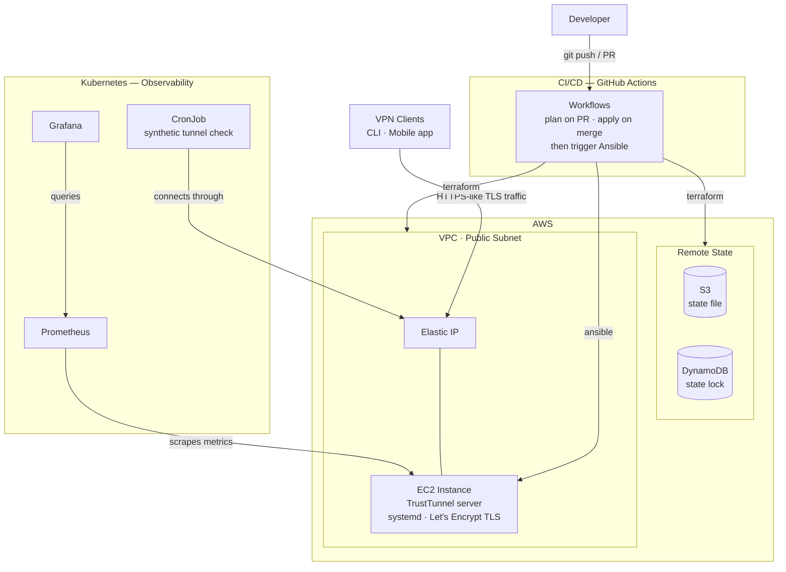

# TrustTunnel VPN — Infrastructure as Code

> A self-hosted VPN built on AdGuard's open-source **TrustTunnel** protocol, provisioned and managed end-to-end with a full DevOps toolchain: **Terraform · Ansible · GitHub Actions · Kubernetes**.


<!-- TODO: once CI is set up, add a live workflow badge here, e.g.

-->

---

## Overview

This project deploys [TrustTunnel](https://github.com/TrustTunnel/TrustTunnel) — a VPN protocol that disguises its traffic as ordinary HTTPS (TLS over HTTP/2 and HTTP/3) to resist fingerprinting and censorship — onto AWS, fully automated.

The point isn't just "a working VPN." It's to demonstrate a realistic, team-grade DevOps workflow: infrastructure as code, configuration management, CI/CD, and observability, each layer doing the job it's actually suited for.

---

## Architecture



**How each tool earns its place:**

| Layer | Tool | Responsibility |
|---|---|---|
| Provisioning | **Terraform** | VPC, subnet, internet gateway, security group, EC2, Elastic IP, key pair; remote state in S3 + DynamoDB |
| Configuration | **Ansible** | Install TrustTunnel, manage Let's Encrypt cert, template config, run as a systemd service, generate client configs |
| CI/CD | **GitHub Actions** | `terraform plan` on PRs, `apply` on merge, then run Ansible against the resulting infrastructure |
| Observability | **Kubernetes** | Prometheus + Grafana, cert-manager, and a synthetic uptime check — **not** the VPN data plane (see [Design Decisions](#design-decisions--trade-offs)) |

---

## Project Structure

```
trust-tunnel-infra/
├── terraform/
│   ├── bootstrap/            # One-time: creates S3 bucket + DynamoDB lock (local state)
│   ├── modules/
│   │   ├── vpc/              # Reusable network module (VPC, subnet, IGW, route table, SG)
│   │   └── ec2/             # Reusable compute module (EC2, Elastic IP, key pair)
│   └── environments/
│       └── dev/             # Calls both modules; state lives in S3
├── ansible/
│   ├── roles/
│   │   └── trusttunnel/      # Install + configure the TrustTunnel server
│   ├── playbooks/
│   └── inventory/            # Pulled dynamically from Terraform output
├── k8s/
│   ├── monitoring/           # Prometheus + Grafana
│   └── cert-manager/
├── .github/
│   └── workflows/            # CI/CD pipelines
└── README.md
```

---

## Project Status

Built in phases — each is independently demoable. Updated as I go.

| Phase | Scope | Status |
|---|---|---|
| 1 | **Terraform** — AWS infrastructure + remote state | ✅ Complete |
| 2 | **Ansible** — TrustTunnel install & configuration | 🚧 Next |
| 3 | **GitHub Actions** — CI/CD pipeline | ⬜ Planned |
| 4 | **Kubernetes** — observability stack | ⬜ Planned |

<details>
<summary>Detailed checklist</summary>

**Phase 1 — Terraform** ✅
- [x] Bootstrap: S3 bucket (versioned, encrypted) + DynamoDB lock table
- [x] VPC module: VPC, public subnet, IGW, route table, security group
- [x] EC2 module: instance, Elastic IP, key pair
- [x] Dev environment: calls the VPC + EC2 modules
- [x] Remote backend wired to S3
- [x] Outputs expose the server IP for Ansible

**Phase 2 — Ansible**
- [ ] Dynamic inventory from Terraform output
- [ ] Role: install TrustTunnel binary
- [ ] Role: certbot / Let's Encrypt certificate
- [ ] Role: template `hosts.toml` + `vpn.toml` (skip interactive wizard)
- [ ] Role: systemd service
- [ ] Generate a client config

**Phase 3 — GitHub Actions**
- [ ] AWS auth via OIDC (no long-lived keys)
- [ ] `terraform plan` on pull requests
- [ ] `terraform apply` on merge to main
- [ ] Trigger Ansible after apply

**Phase 4 — Kubernetes**
- [ ] Prometheus + Grafana via Helm
- [ ] cert-manager
- [ ] Grafana dashboard for VPN metrics
- [ ] CronJob: synthetic end-to-end tunnel check

</details>

---

## Getting Started

### Prerequisites

- An AWS account and configured credentials
- [Terraform](https://developer.hashicorp.com/terraform/install) `>= 1.5`
- [Ansible](https://docs.ansible.com/ansible/latest/installation_guide/intro_installation.html)
- A registered domain (needed if you want a real CA-issued cert for the mobile client)
- `kubectl` + a Kubernetes cluster (Phase 4 only)

### Phase 1 — Provision infrastructure

> Full run order, required variables, and gotchas are in [`terraform/README.md`](terraform/README.md). Quick version:

```bash
# 1. One-time: create the remote-state backend (uses local state)
cd terraform/bootstrap
terraform init
terraform apply -var="state_bucket_name=<your-unique-bucket-name>"

# 2. Point the dev backend at that bucket
#    edit terraform/environments/dev/backend.tf → set the bucket name

# 3. Provision the infrastructure
cd ../environments/dev
cp terraform.tfvars.example terraform.tfvars   # then fill in your SSH key + IP
terraform init
terraform plan
terraform apply
```

> **Region note:** this targets `eu-north-1`, which has no `t2` instance family — use `t3.micro` (also the free-tier type there).
### Phase 2 — Configure the server *(coming soon)*

### Phase 3 — CI/CD *(coming soon)*

### Phase 4 — Observability *(coming soon)*

<!-- TODO: add a Grafana dashboard screenshot once Phase 4 is live -->

---

## Design Decisions & Trade-offs

The reasoning behind the non-obvious choices — the parts worth discussing.

- **Remote state from day one.** State lives in an encrypted, versioned S3 bucket with a DynamoDB lock, rather than on a laptop. This is what makes the setup safe for CI/CD and for more than one operator — a single source of truth that can't be corrupted by two simultaneous runs. The `bootstrap` config that creates this backend uses *local* state itself, because the bucket can't store its own state before it exists.

- **Module / environment separation.** Network logic lives once in `modules/vpc`; the `dev` environment just calls it with specific values. Adding a `prod` environment later means reusing the same module with different inputs — no copy-pasted infrastructure.

- **Skipping TrustTunnel's interactive setup wizard.** The wizard expects manual input, which doesn't fit unattended automation. Instead, Ansible templates the `hosts.toml` and `vpn.toml` config files directly with Jinja2 and starts the service — repeatable and fully hands-off.

- **Kubernetes hosts observability, not the VPN itself.** Running the VPN's data plane inside Kubernetes would require privileged pods and host networking — a real source of friction. Keeping the VPN server on a dedicated VM (configured by Ansible) and using Kubernetes only for the monitoring/management plane keeps responsibilities clean and reflects where each tool genuinely fits.

- **OIDC for AWS auth in CI.** GitHub Actions authenticates to AWS via short-lived OIDC tokens instead of long-lived access keys stored as secrets — fewer standing credentials to leak.

---

## Acknowledgements

Built on [**TrustTunnel**](https://github.com/TrustTunnel/TrustTunnel) by AdGuard, released under the Apache 2.0 license. This project automates its deployment; all credit for the protocol and server implementation goes to its authors.

---

## Disclaimer

This is a **personal, educational** infrastructure project, not a commercial VPN service. Deploy and operate it only on resources you own, and use it in line with the laws and terms of service that apply to you.

---

## License

<!-- TODO: pick a license (MIT is a common, permissive default for portfolio repos) and add a LICENSE file -->
Released under the MIT License — see `LICENSE`.
