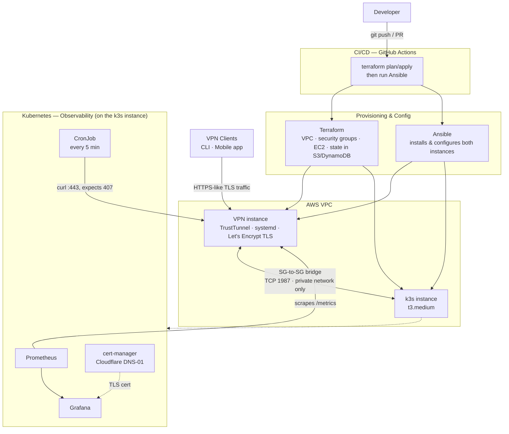
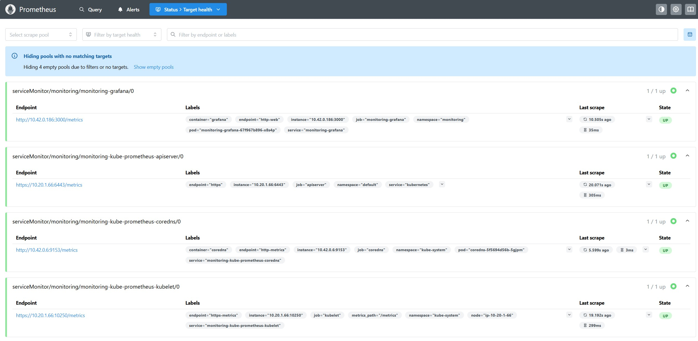
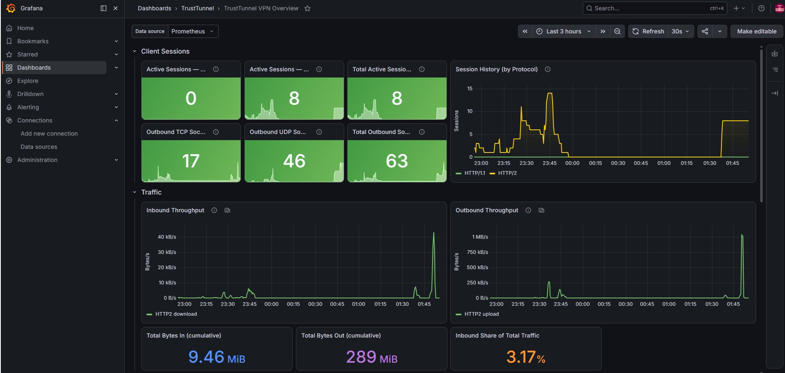
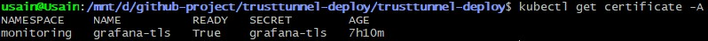
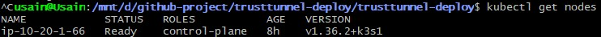

# TrustTunnel VPN — Infrastructure as Code

> A self-hosted VPN built on AdGuard's open-source **TrustTunnel** protocol, provisioned and managed end-to-end with a full DevOps toolchain: **Terraform · Ansible · GitHub Actions · Kubernetes**.


---

## Overview

This project deploys [TrustTunnel](https://github.com/TrustTunnel/TrustTunnel) — a VPN protocol that disguises its traffic as ordinary HTTPS (TLS over HTTP/2 and HTTP/3) to resist fingerprinting and censorship — onto AWS, fully automated.

The point isn't just "a working VPN." It's to demonstrate a realistic, team-grade DevOps workflow: infrastructure as code, configuration management, CI/CD, and observability, each layer doing the job it's actually suited for.

---

## Architecture



**How each tool earns its place:**

| Layer | Tool | Responsibility |
|---|---|---|
| Provisioning | **Terraform** | VPC, subnet, internet gateway, security groups, EC2 (VPN + k3s), Elastic IP, key pair; remote state in S3 + DynamoDB |
| Configuration | **Ansible** | Install TrustTunnel, manage Let's Encrypt cert, template config, run as a systemd service, generate client configs, install k3s, fetch/repair kubeconfig |
| CI/CD | **GitHub Actions** | `terraform plan` on PRs, `apply` on merge, then run Ansible against the resulting infrastructure |
| Observability | **Kubernetes** | Prometheus + Grafana, cert-manager, synthetic uptime check — **not** the VPN data plane (see [Design Decisions](#design-decisions--trade-offs)) |

---

## Project Structure

```
trust-tunnel-infra/
├── terraform/
│   ├── bootstrap/            # One-time: creates S3 bucket + DynamoDB lock (local state)
│   ├── modules/
│   │   ├── vpc/              # Reusable network module (VPC, subnet, IGW, route table, SG)
│   │   └── ec2/              # Reusable compute module (EC2, Elastic IP, key pair)
│   └── environments/
│       └── dev/               # Calls both modules; state lives in S3
│           └── k3s.tf         # k3s instance + SG-to-SG bridge rule
├── ansible/
│   ├── roles/
│   │   ├── trusttunnel/       # Install + configure the TrustTunnel server
│   │   └── k3s/               # Install k3s, fetch + repair kubeconfig
│   ├── playbooks/
│   │   ├── site.yml
│   │   └── k3s.yml
│   └── inventory/             # Pulled dynamically from Terraform output
├── k8s/
│   ├── deploy.sh              # One-command monitoring stack orchestrator
│   ├── prometheus-grafana/
│   │   ├── values.yaml        # Scrape config + Grafana sidecar provisioning
│   │   └── dashboards/
│   │       ├── trusttunnel-overview.json      # Canonical dashboard (source of truth)
│   │       └── trusttunnel-dashboard-cm.yaml  # ConfigMap wrapper for sidecar discovery
│   ├── cert-manager/
│   │   └── cluster-issuer.yaml
│   └── synthetic-check/
│       └── cronjob.yaml
├── docs/
│   └── verification/          # Screenshot evidence for each phase's "Verified Run"
├── .github/
│   └── workflows/             # CI/CD pipelines
└── README.md
```

---

## Project Status

Built in phases — each is independently demoable. Updated as I go.

| Phase | Scope | Status |
|---|---|---|
| 1 | **Terraform** — AWS infrastructure + remote state | ✅ Complete |
| 2 | **Ansible** — TrustTunnel install & configuration | ✅ Complete |
| 3 | **GitHub Actions** — CI/CD pipeline | ✅ Complete |
| 4 | **Kubernetes** — observability stack | ✅ Complete |

<details>
<summary>Detailed checklist</summary>

**Phase 1 — Terraform**
- [x] Bootstrap: S3 bucket (versioned, encrypted) + DynamoDB lock table
- [x] VPC module: VPC, public subnet, IGW, route table, security group
- [x] Dev environment: EC2, Elastic IP, key pair, calls VPC module
- [x] Remote backend wired to S3
- [x] Outputs expose the server IP for Ansible

**Phase 2 — Ansible**
- [x] Dynamic inventory from Terraform output
- [x] Role: install TrustTunnel binary
- [x] Role: automated DNS A record via Cloudflare API (create + patch-on-drift)
- [x] Role: certbot / Let's Encrypt certificate
- [x] Role: template `hosts.toml` + `vpn.toml` (skip interactive wizard)
- [x] Role: hardened systemd service
- [x] Generate client deeplink at end of run
- [x] Secrets managed with Ansible Vault

**Phase 3 — GitHub Actions**
- [x] AWS auth via OIDC (no long-lived keys)
- [x] `terraform plan` on pull requests (with PR comment)
- [x] `terraform apply` on merge to main
- [x] Trigger Ansible after apply
- [x] Dynamic security group rule for runner SSH access (with auto-cleanup)

**Phase 4 — Kubernetes**
- [x] Dedicated k3s node (Terraform), same VPC as the VPN instance
- [x] SG-to-SG bridge: k3s node → VPN instance, TCP 1987, private network only
- [x] Ansible role: install k3s, fetch kubeconfig, rewrite `server` field to the real IP
- [x] Prometheus + Grafana via `kube-prometheus-stack` Helm chart
- [x] Static Prometheus scrape target at the VPN instance's private IP
- [x] cert-manager + Cloudflare DNS-01 `ClusterIssuer`, reusing the existing scoped API token
- [x] Grafana dashboard built from real, confirmed TrustTunnel metric names — provisioned as a git-tracked ConfigMap, not clicked together in the UI
- [x] Synthetic uptime CronJob, surfaced via `kube-state-metrics`, zero custom exporters
- [x] `k8s/deploy.sh` — single-command orchestrator for the whole monitoring stack

</details>

---

## Getting Started

### Prerequisites

- An AWS account and configured credentials
- [Terraform](https://developer.hashicorp.com/terraform/install) `>= 1.5`
- [Ansible](https://docs.ansible.com/ansible/latest/installation_guide/intro_installation.html)
- A registered domain (needed if you want a real CA-issued cert for the mobile client and for Grafana)
- `kubectl` and `helm` (Phase 4 only)

### Phase 1 — Provision infrastructure

> Full run order, required variables, and gotchas are in [`terraform/README.md`](terraform/README.md). Quick version:

```bash
# 1. One-time: create the remote-state backend (uses local state)
cd terraform/bootstrap
terraform init
terraform apply -var="state_bucket_name=<your-unique-bucket-name>"

# 2. Point the dev backend at that bucket
#    edit terraform/environments/dev/backend.tf → set the bucket name

# 3. Provision the infrastructure
cd ../environments/dev
cp terraform.tfvars.example terraform.tfvars   # then fill in your SSH key + IP
terraform init
terraform plan
terraform apply
```

### Phase 2 — Configure the server

```bash
cd ansible/

# install required Ansible collection
ansible-galaxy collection install community.general

# copy and fill in secrets
cp vpn_secrets.yml.example vpn_secrets.yml
# edit vpn_secrets.yml — add VPN credentials, Cloudflare token, Cloudflare zone ID

# encrypt secrets with Ansible Vault
ansible-vault encrypt vpn_secrets.yml
# save the vault password somewhere safe (password manager)

# store vault password locally for convenience (git-ignored)
echo "your-vault-password" > vault_pass.txt

# generate inventory from Terraform output
./inventory/generate-inventory.sh

# run the full playbook
ansible-playbook playbooks/site.yml
```

At the end of the run, a `tt://` deeplink is printed. Open it in the TrustTunnel app to connect.

See [`ansible/README.md`](ansible/README.md) for full details on configuration, tags, and security decisions.

### Phase 3 — CI/CD

The pipeline runs automatically on every push to `main`:

1. **Terraform** provisions (or updates) all AWS infrastructure
2. **Ansible** configures the server — installs TrustTunnel, obtains a TLS cert, starts the service

On pull requests, Terraform runs `plan` only and comments the output on the PR for review.

Key design choices:
- **OIDC authentication** — no long-lived AWS keys stored as secrets; GitHub gets short-lived tokens via OpenID Connect
- **Dynamic SSH access** — the runner's public IP is temporarily authorized in the security group, then revoked in an `always()` cleanup step (even on failure)
- **Secrets isolation** — vault password and SSH key are written to ephemeral files, never printed to logs, and deleted after use

> [View pipeline runs](https://github.com/McBrave/trusttunnel-deploy/actions)

### Phase 4 — Observability

Full walkthrough, architecture rationale, and troubleshooting notes live in [`k8s/README.md`](k8s/README.md). Quick version:

```bash
# 1. Provision the k3s node (same Terraform state as the VPN instance)
cd terraform/environments/dev
terraform apply
terraform output k3s_public_ip
terraform output vpn_private_ip

# 2. Install k3s and repair its kubeconfig
cd ../../ansible
./inventory/generate-inventory-k3s.sh
ansible-playbook playbooks/k3s.yml

# 3. Verify the SG-to-SG metrics bridge before touching Helm
ssh ubuntu@$(terraform -chdir=../terraform/environments/dev output -raw k3s_public_ip)
curl -s http://<VPN_PRIVATE_IP>:1987/metrics | head -20
# Prometheus-format output here proves the bridge works end to end

# 4. Deploy the whole monitoring stack in one command
export KUBECONFIG="$(pwd)/ansible/kubeconfig-k3s.yaml"
CF_TOKEN=$(ansible-vault view ansible/vpn_secrets.yml | grep cloudflare_api_token | awk '{print $2}' | tr -d '"' | tr -d '[:space:]')
bash k8s/deploy.sh <VPN_PRIVATE_IP> grafana.yourdomain.xyz "$CF_TOKEN"
```

`deploy.sh` installs cert-manager and its `ClusterIssuer`, installs/upgrades `kube-prometheus-stack`, provisions the Grafana dashboard as a git-tracked ConfigMap, and deploys the synthetic uptime CronJob — all idempotently, all from committed config, no manual Grafana UI steps.

**Verified Run:**

Prometheus target healthy — proves the SG-to-SG bridge is actually passing traffic, not just that the rule exists:



Grafana dashboard, built entirely from real, confirmed TrustTunnel metric names:



TLS certificate issued via cert-manager + Cloudflare DNS-01:



k3s cluster healthy:



> As with the VPN instance, the EC2 resources backing this run are destroyed between test cycles to save cost. This section, the [Actions history](https://github.com/McBrave/trusttunnel-deploy/actions), and the git-tracked dashboard/Helm config stand as the permanent record — anyone re-running `deploy.sh` against a fresh cluster gets the same dashboard back automatically.

---

## Design Decisions & Trade-offs

The reasoning behind the non-obvious choices — the parts worth discussing.

- **Remote state from day one.** State lives in an encrypted, versioned S3 bucket with a DynamoDB lock, rather than on a laptop. This is what makes the setup safe for CI/CD and for more than one operator — a single source of truth that can't be corrupted by two simultaneous runs. The `bootstrap` config that creates this backend uses *local* state itself, because the bucket can't store its own state before it exists.

- **Module / environment separation.** Network logic lives once in `modules/vpc`; the `dev` environment just calls it with specific values. Adding a `prod` environment later means reusing the same module with different inputs — no copy-pasted infrastructure.

- **Skipping TrustTunnel's interactive setup wizard.** The wizard expects manual input, which doesn't fit unattended automation. Instead, Ansible templates the `hosts.toml` and `vpn.toml` config files directly with Jinja2 and starts the service — repeatable and fully hands-off.

- **Kubernetes hosts observability, not the VPN itself.** Running the VPN's data plane inside Kubernetes would require privileged pods and host networking — a real source of friction. Keeping the VPN server on a dedicated VM (configured by Ansible) and using Kubernetes only for the monitoring/management plane keeps responsibilities clean and reflects where each tool genuinely fits.

- **A dedicated k3s node, not EKS or local kind/minikube.** EKS's control-plane cost doesn't make sense for something that isn't running continuously; local kind/minikube can't reach the VPN's private VPC network at all, which is a hard requirement for the metrics bridge. A small dedicated EC2 instance in the same VPC is the cheapest option that can actually see the VPN's private IP.

- **SG-to-SG bridge instead of exposing metrics publicly.** The VPN's `/metrics` endpoint stays bound to `127.0.0.1` and is only reachable by adding a security-group rule that allows the k3s node's security group (referenced by ID via Terraform, never a hardcoded `sg-xxxx` string) to reach port 1987 over the private network. Nothing about the monitoring stack is exposed to the public internet except Grafana's own Ingress, which is protected by its own TLS cert and login.

- **cert-manager reuses the existing Cloudflare API token.** The token was already scoped with `Zone:DNS:Edit` + `Zone:Zone:Read` for Ansible's DNS automation in Phase 2 — exactly the scope DNS-01 needs. It's passed into the cluster as a Kubernetes Secret at deploy time, decrypted from the same Ansible Vault file, and is never committed in plaintext anywhere.

- **Dashboard built from confirmed metric names, not invented ones.** TrustTunnel's `/metrics` endpoint isn't a widely documented format. Rather than guessing plausible-sounding metric names, the dashboard was built only after `curl`-ing the real endpoint through the confirmed-working SG bridge and reading the actual `client_sessions`, `inbound_traffic_bytes`, `outbound_tcp_sockets`, etc. output. One real finding from this: TrustTunnel doesn't expose a separate `protocol_type="QUIC"` label — QUIC traffic is counted through the generic `outbound_udp_sockets` gauge instead (confirmed by watching that gauge drop on a QUIC client disconnect). The dashboard documents this honestly rather than fabricating a QUIC-specific panel.

- **Dashboard provisioned as a git-tracked ConfigMap, not built by hand in the Grafana UI.** `trusttunnel-overview.json` is the source of truth, wrapped in a ConfigMap labeled for Grafana's sidecar (`grafana_dashboard: "1"`) and marked `editable: false`. Any change goes through git, and any fresh cluster gets the exact same dashboard back with zero manual clicking.

- **Synthetic check treats `407` as success, not failure.** TrustTunnel behaves as a secure HTTP/2 proxy, so a healthy, correctly-configured endpoint *should* return `407 Proxy Authentication Required` to an unauthenticated `curl`. That specific code proves three things at once: the daemon is alive, TLS negotiated successfully, and the auth guard is actively rejecting unauthorized traffic — which is exactly the behavior you want from a security boundary. Any other code (5xx, TLS failure, timeout) is treated as a real failure.

- **No custom exporter for the uptime check.** The synthetic check's container simply exits non-zero on failure. Kubernetes marks the Job `Failed`, and `kube-state-metrics` — already running as part of `kube-prometheus-stack` — surfaces that automatically as `kube_job_status_failed`, which Prometheus scrapes like anything else. No extra exporter, no extra maintenance surface.

- **OIDC for AWS auth in CI.** GitHub Actions authenticates to AWS via short-lived OIDC tokens instead of long-lived access keys stored as secrets — fewer standing credentials to leak. The IAM role is scoped to only the permissions this project needs (EC2, S3 state bucket, DynamoDB lock table) and locked to this specific repo via the OIDC trust policy.

- **Ephemeral SSH access in CI.** Rather than opening port 22 to the world, the pipeline dynamically adds the runner's IP to the security group before Ansible runs, and revokes it afterward with an `always()` guard — so it cleans up even on failure.

---

## Acknowledgements

Built on [**TrustTunnel**](https://github.com/TrustTunnel/TrustTunnel) by AdGuard, released under the Apache 2.0 license. This project automates its deployment; all credit for the protocol and server implementation goes to its authors.

---

## Disclaimer

This is a **personal, educational** infrastructure project, not a commercial VPN service. Deploy and operate it only on resources you own, and use it in line with the laws and terms of service that apply to you.

---

## License

Released under the MIT License — see `LICENSE`.