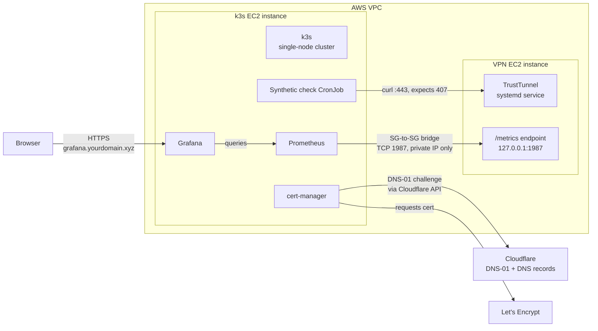

# Phase 4 — Kubernetes Observability Stack

This directory provisions the monitoring plane for the TrustTunnel VPN: a dedicated k3s cluster that scrapes the VPN instance's metrics over a private-network security-group bridge, visualizes them in Grafana behind a real Let's Encrypt certificate, and runs a synthetic uptime check — all deployed with a single script, with zero manual Grafana UI configuration.

---

## Why Kubernetes here, and why not for the VPN itself

The VPN's data plane stays on a dedicated EC2 instance managed by Ansible (Phase 2). Running it inside Kubernetes would mean privileged pods and host networking just to get raw socket access — friction with no real payoff. Kubernetes is used only where it's actually the right tool: running a monitoring stack (Prometheus, Grafana, cert-manager, a CronJob) that benefits from Helm's packaging, declarative config, and a controller model for cert renewal.

**Why a dedicated k3s node instead of EKS or local kind/minikube:**
- EKS's control plane costs money continuously, even when idle — doesn't fit a project that's destroyed between test cycles
- Local kind/minikube can't reach the VPN's private VPC network at all, which is a hard requirement for scraping its metrics endpoint
- A small EC2 instance in the *same* VPC as the VPN is the cheapest option that can actually see the VPN's private IP

---

## Architecture



**Key design point:** the VPN's metrics endpoint stays bound to `127.0.0.1` — it is never exposed publicly. The only way in is a security-group rule that allows the k3s node's security group (referenced by ID via Terraform, never a hardcoded `sg-xxxx` string — a fresh SG gets a fresh ID every destroy/recreate cycle) to reach port 1987 on the VPN instance's SG. Nothing about this bridge touches the public internet.

---

## Components

### `terraform/environments/dev/k3s.tf`
Provisions the k3s EC2 instance (same VPC, same Terraform state/environment as the VPN instance — reuses the existing `modules/vpc`) and the SG rule enabling the bridge described above.

- **Instance size: `t3.medium`.** `t3.small` (2GB RAM) was tried first and reliably fell over under `kube-prometheus-stack`'s combined footprint (Prometheus + Grafana + Alertmanager + kube-state-metrics + node-exporter) — the API server's embedded datastore (kine/SQLite) showed 19+ second query times and multi-minute request timeouts under load, which cascaded into failed Helm installs (`http2: client connection force closed`, `connection reset by peer`). `t3.medium` gives real headroom.

### `ansible/roles/k3s/`
Installs k3s idempotently, fetches the generated kubeconfig back to the control machine, and — this is a well-known k3s gotcha — rewrites the kubeconfig's `server:` field from `127.0.0.1` to the node's real IP, since the file k3s generates on-box is only valid for local/loopback use as-is. Runs via `playbooks/k3s.yml`, kept separate from `site.yml` so VPN configuration and k3s provisioning can be run independently.

### `k8s/prometheus-grafana/values.yaml`
Helm values for the `kube-prometheus-stack` chart:
- A static Prometheus scrape target pointed at the VPN instance's **private IP** on port 1987. Static, not service-discovered, because TrustTunnel isn't a Kubernetes-native workload — there's no Service/Endpoints object for Prometheus to discover.
- Grafana's `sc-dashboard` sidecar enabled, with `foldersFromFilesStructure: true`, so any correctly labeled ConfigMap in the cluster is automatically picked up and organized into folders — this is what makes the dashboard GitOps-driven rather than something clicked together in the UI.

### `k8s/prometheus-grafana/dashboards/`
- **`trusttunnel-overview.json`** — the canonical dashboard definition, and the actual source of truth. Built only after confirming the SG-to-SG bridge worked and reading TrustTunnel's real `/metrics` output — no metric name on this dashboard was guessed. Panels:
  - Concurrent client sessions, stacked by protocol (HTTP/1.1 vs HTTP/2)
  - Real-time throughput and cumulative bytes transferred, oriented to a client's perspective (download/inbound vs upload/outbound)
  - Process resource footprint: RSS memory, virtual memory, OS thread count, open vs max file descriptors, process uptime
  - Outbound TCP and UDP socket counts

  **Known limitation, documented rather than papered over:** TrustTunnel does not expose a separate `protocol_type="QUIC"` label on any metric, even though QUIC is a configured and actively used listener. QUIC connections are counted through the generic `outbound_udp_sockets` gauge instead — confirmed by watching that gauge drop when a QUIC client disconnected. The dashboard labels this panel honestly ("Outbound Sockets — TCP / UDP, includes QUIC") instead of inventing a QUIC-specific panel TrustTunnel doesn't actually support.

- **`trusttunnel-dashboard-cm.yaml`** — wraps the JSON in a ConfigMap labeled `grafana_dashboard: "1"` and annotated `grafana_folder: "TrustTunnel"` for sidecar discovery, with `editable: false` set inside the dashboard JSON itself so changes have to go through git rather than being made (and then lost) in the UI.

### `k8s/cert-manager/cluster-issuer.yaml`
A `ClusterIssuer` using Let's Encrypt with a Cloudflare DNS-01 solver. Reuses the **same** Cloudflare API token already scoped for DNS automation in Phase 2 (`Zone:DNS:Edit` + `Zone:Zone:Read` — exactly what DNS-01 needs, no new token or scope required). The token is decrypted from the existing Ansible Vault file at deploy time and created as a Kubernetes Secret — never committed in plaintext in any manifest.

Grafana itself is exposed via an Ingress on a dedicated subdomain (e.g. `grafana.yourdomain.xyz`), using the same idempotent check-before-create DNS pattern as the VPN's own `dns.yml` role.

### `k8s/synthetic-check/cronjob.yaml`
A Kubernetes `CronJob` running every 5 minutes:

1. **Signature probe** — `curl`s the VPN's public endpoint on port 443. Because TrustTunnel behaves as a secure HTTP/2 proxy, a **healthy** endpoint returns `407 Proxy Authentication Required` to an unauthenticated request — proving in one shot that the daemon is alive, TLS negotiated successfully, and the auth guard is actively rejecting unauthorized traffic. Any other outcome (5xx, TLS handshake failure, timeout) is a real failure and exits non-zero.
2. **Exporter-less failure surfacing** — on a non-zero exit, Kubernetes marks the Job `Failed`. `kube-state-metrics` (already running as part of `kube-prometheus-stack`) picks this up automatically via the Kubernetes API and exposes it as the standard `kube_job_status_failed` metric, which Prometheus scrapes like any other target. No custom exporter, no extra log pipeline, no additional maintenance surface — the whole check rides on infrastructure that's already there for other reasons.

### `k8s/deploy.sh`
The single-command orchestrator tying all of the above together:
- Installs `cert-manager` and applies the Cloudflare `ClusterIssuer`
- Substitutes runtime values (subdomain, VPN private IP, Cloudflare token) into the static manifests
- Installs/upgrades `kube-prometheus-stack` via Helm
- Applies the dashboard ConfigMap and the synthetic-check CronJob

```bash
bash k8s/deploy.sh <VPN_PRIVATE_IP> grafana.yourdomain.xyz "$CF_TOKEN"
```

---

## Manual verification steps

Run these in order — each one confirms a specific layer before moving to the next, so a failure is easy to localize.

```bash
# 1. Apply Terraform
cd terraform/environments/dev
terraform apply

# 2. Confirm new outputs exist
terraform output k3s_public_ip
terraform output vpn_private_ip

# 3. Generate inventory and run Ansible
cd ../../ansible
./inventory/generate-inventory.sh
./inventory/generate-inventory-k3s.sh
ansible-playbook playbooks/k3s.yml

# 4. SSH to the k3s node and verify the metrics bridge works
ssh ubuntu@$(terraform -chdir=../terraform/environments/dev output -raw k3s_public_ip)

# on the k3s node — curl the VPN's metrics endpoint via the private network:
curl -s http://<VPN_PRIVATE_IP>:1987/metrics | head -20
# Prometheus-format output here = the SG-to-SG rule works.
# A timeout means the security group rule isn't applied — check `terraform state show`.

# 5. Confirm k3s is healthy
sudo k3s kubectl get nodes    # should show Ready
sudo k3s kubectl get pods -A  # only k3s system pods at this point

# 6. Deploy the Helm stack (from your local machine, not the EC2 instance)
export KUBECONFIG="$(pwd)/ansible/kubeconfig-k3s.yaml"
kubectl get nodes  # verify remote access works before deploying anything

CF_TOKEN=$(ansible-vault view ansible/vpn_secrets.yml \
  | grep cloudflare_api_token | awk '{print $2}' | tr -d '"' | tr -d '[:space:]')

bash k8s/deploy.sh <VPN_PRIVATE_IP> grafana.yourdomain.xyz "$CF_TOKEN"
```

**Two gotchas worth calling out explicitly, both hit during development:**

- **The Cloudflare token must be stripped of surrounding quotes and whitespace before use.** If `vpn_secrets.yml` stores it as `cloudflare_api_token: "cfut_..."`, a naive `awk '{print $2}'` extraction captures the literal quote characters along with the token, which Cloudflare's API rejects with `6111: Invalid format for Authorization header`. Always pipe through `tr -d '"' | tr -d '[:space:]'`.
- **A failed/interrupted Certificate can leave a zombie ACME Challenge behind**, stuck with a `Deletion Timestamp` in the past and a finalizer that never clears (usually because cert-manager is still retrying cleanup against the bad token that caused the original failure). If `kubectl get challenges -A` shows an old challenge that won't go away, force-remove its finalizer:
  ```bash
  kubectl patch challenge <stuck-challenge-name> -n monitoring \
    --type=json -p='[{"op": "remove", "path": "/metadata/finalizers"}]'
  ```
  Then delete the Order/CertificateRequest/Certificate to force a completely fresh attempt.

---

## Verified Run

Prometheus target healthy — this is the strongest single proof that the SG-to-SG bridge is actually passing live traffic, not just that the security-group rule exists:


Grafana dashboard, rendering real TrustTunnel metrics scraped over the bridge:


TLS certificate issued via cert-manager + Cloudflare DNS-01:


k3s cluster healthy:


> The EC2 instances backing this run are destroyed between test cycles to keep costs at zero when nothing is actively being demoed. This page, the git-tracked dashboard JSON, and the Helm values in this directory are the permanent record — running `deploy.sh` against a freshly provisioned cluster reproduces the exact same dashboard and monitoring setup with no manual steps.

---

## Known limitations / open items

- **QUIC has no dedicated metric label.** Documented above — QUIC sessions currently surface only through the generic `outbound_udp_sockets` gauge. Fixing this would require a change in TrustTunnel itself, not this deployment repo.
- **`deploy.sh` vs. folding into Ansible or GitHub Actions.** Currently a standalone script run manually from a local machine after the Ansible/Terraform steps. Folding it into the Ansible k3s role would match the project's "everything automated" pattern most closely; moving it into GitHub Actions as a new job is the alternative if full CI/CD coverage for Phase 4 becomes a priority.
- **Single-node k3s.** Fine for a monitoring-only cluster with no real availability requirement; would need revisiting if this pattern were ever extended to run anything user-facing.
